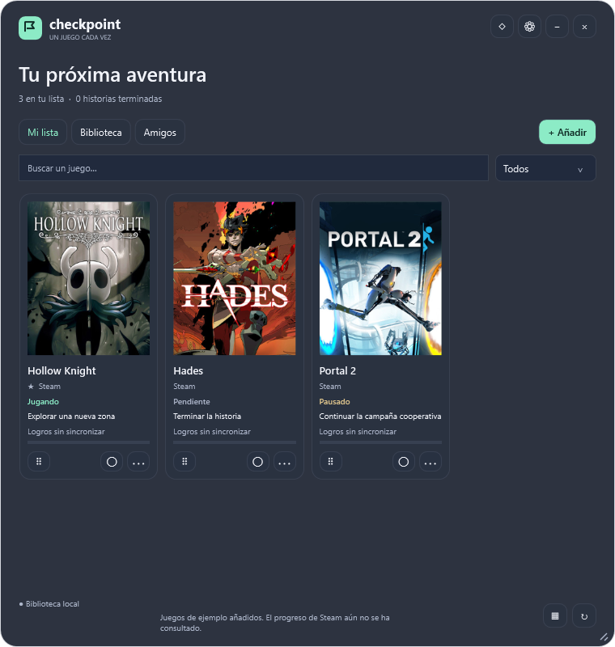
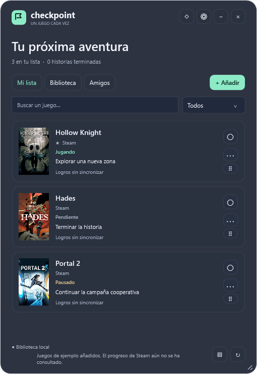
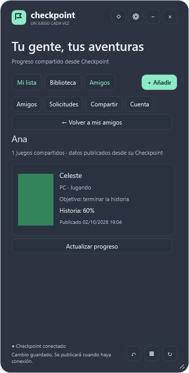

[English](README.md) · **Español**

# Checkpoint

Un juego cada vez. Widget nativo y translúcido para organizar los juegos que quieres pasarte en Windows.

> **AVISO IMPORTANTE — SMARTSCREEN:** los EXE/MSI de GitHub no tienen firma ni certificado de editor. La ausencia de firma y de reputación puede provocar «Windows protegió su PC». **No tengo certificado porque supone un coste; no lo compraré hasta que los ingresos de Checkpoint cubran al menos lo que cueste. Hasta entonces, estas descargas seguirán sin certificado.** Firmar tampoco garantiza que el aviso desaparezca inmediatamente. [Lee el aviso y los requisitos](docs/DOWNLOAD-NOTES.md).



## Capturas

Capturas de la aplicación Windows 0.6.1 renderizadas durante las pruebas nativas. Los juegos, usuarios y progresos son datos de ejemplo; las carátulas privadas de prueba usan una imagen de color plano. Consulta la [galería de capturas](docs/SCREENSHOTS.md) para ver lista, vista compacta, amigos y ajustes.

| Biblioteca | Amigos de Checkpoint |
| --- | --- |
|  |  |

## Descargar y utilizar

La versión actual es **0.6.8**. En la carpeta `dist` se generan:

Descarga el portable o instalador desde [GitHub Releases](https://github.com/Nicolasmf05/Checkpoint/releases/tag/v0.6.8), o compila con las instrucciones de este repositorio. El workflow **Build and verify** también genera el ZIP y MSI como artefactos cuando finaliza correctamente.

- `Checkpoint-0.6.8-win-x64.msi`: instalador por usuario con acceso en el menú Inicio y desinstalación desde Windows.
- `Checkpoint-0.6.8-win-x64.zip`: edición portable. Extrae el ZIP y abre `Checkpoint/Checkpoint.exe`. Todos los archivos quedan dentro de la carpeta `Checkpoint`.
- Archivos `.sha256`: comprobación de integridad.

Los paquetes incluyen el runtime de .NET; el usuario no necesita instalar herramientas de desarrollo. La versión x64 está dirigida a Windows 11; Windows 10 no ha sido validado. La compilación ARM64 está preparada en el script, pero no se ha probado en hardware ARM.

El MSI y el EXE aún no tienen firma digital. Windows puede mostrar un aviso o bloqueo: [mensajes de seguridad](docs/WINDOWS-SECURITY.md). El proyecto no incluye certificados privados.

La distribución por Microsoft Store se prepara por separado: [guía de MSIX y publicación](docs/MICROSOFT-STORE.md). El MSIX de prueba sin firma es para validar el empaquetado; no elimina los avisos de las descargas actuales de GitHub.

## Requisitos para utilizarla

Windows x64 (Windows 11 probado), carpeta accesible para tu usuario y espacio para los archivos. **Sin instalar .NET ni herramientas de desarrollo, sin permisos de administrador y sin cuenta ni Internet para la biblioteca manual.** Steam, carátulas online y amigos son opcionales. RAM/CPU mínimos en equipos antiguos aún no medidos. [Requisitos y consumo](docs/DOWNLOAD-NOTES.md).

## Incluido

- **Cambio rápido de estado en Miniatura:** clic derecho sobre un juego para elegir su estado. El actual aparece marcado; se guarda sin salir de la lista de nombre/estado.
- **Acciones de ventana en Miniatura:** clic derecho en el fondo o un juego para activar Mantener siempre visible o Bloquear posición y tamaño. Las marcas reflejan los ajustes guardados.
- **Teclado en Miniatura:** ↑/↓ recorren juegos, Inicio/Fin van al primero/último y Enter/Espacio abren el menú de estados. Un contorno marca la fila activa; recupera el foco al cerrar el menú o cambiar estado.
- **Vista Miniatura:** solo nombres y estados en una ventana pequeña y translúcida. Ajustes → Vista de la colección → Miniatura, o cambia con F6. Clic derecho → Salir de miniatura. Tamaño independiente del widget normal; se mueve desde el borde superior. Muestra Mi lista, sin filtros ni descargas de carátulas.
- **Modo ligero opcional:** Ajustes → Modo ligero (sin carátulas). Oculta imágenes de colección/amigos, evita nuevas descargas y vacía la caché decodificada. Conserva el progreso y los archivos guardados.
- Widget sin marco, movible, redimensionable, con posición guardada y opacidad del **fondo** ajustable entre 35 % y 100 %.
- Translucidez que conserva su apariencia al perder el foco. Esta edición utiliza transparencia alfa, **sin desenfoque Acrylic**.
- Temas claro y oscuro, vistas de lista, compacta y cuadrícula de carátulas, y opción de mantenerlo encima de otras ventanas.
- Interfaz en español e inglés: Ajustes → Idioma, con cambio inmediato y elección guardada. Los textos propios de los juegos se conservan.
- Mi lista y biblioteca, búsqueda y filtro por estado. Lista y filas de cuadrícula virtualizadas para colecciones grandes.
- Carátulas descargadas al usar juegos de Steam, caché local y selección de imágenes propias.
- Estados pendiente, jugando, pausado, historia terminada y abandonado; favoritos y orden por arrastre o teclado.
- Objetivo de historia, todos los logros o personalizado; notas y tareas con casillas.
- Importación de Steam y consulta de logros a través del servicio incluido; logros secretos ocultos por defecto.
- Actualización manual y cada 15, 30, 60 o 120 minutos. Cada ciclo consulta como máximo 20 juegos de Mi lista, empezando por los menos actualizados.
- Bandeja del sistema, inicio con Windows opcional y bloqueo de posición/tamaño.
- Biblioteca SQLite, copias completas con carátulas e importación que añade juegos sin sobrescribir los ya presentes. Se conservan los JSON anteriores.
- Recuperación de los últimos 20 juegos eliminados, con datos y carátulas, disponible después de reiniciar.
- Cuentas de Checkpoint con usuario y contraseña, solicitudes de amistad y progreso compartido mediante Supabase.
- Porcentaje manual de historia, publicación explícita de juegos y reintentos de publicación al recuperar la conexión.

**Historia terminada y todos los logros son independientes.** La sincronización nunca decide que has terminado una historia y conserva los datos previos si Steam falla.

Atajos: `Ctrl+Alt+C` muestra u oculta; `Ctrl+N` añade un juego; `Ctrl+F` busca; `F6` alterna las tres vistas; `Ctrl+Z` recupera el último juego eliminado cuando no estás editando texto; `Escape` oculta. Si otro programa ocupa `Ctrl+Alt+C`, puedes abrir Checkpoint desde la bandeja.

Para reordenar, arrastra el asa `⠿` de un juego hasta otro: la mitad superior coloca antes y la inferior después. También puedes enfocar el asa con Tab y usar `Alt+↑` / `Alt+↓`. Los favoritos permanecen arriba; puedes reordenar dentro de cada grupo. Los juegos ocultos por los filtros conservan su orden relativo. El botón de vista de la esquina inferior y Ajustes permiten elegir lista, compacta o cuadrícula; esta última cambia de columnas al redimensionar.

Los datos viven en `%LOCALAPPDATA%\Checkpoint`. La desinstalación conserva esa biblioteca. Los tokens están protegidos con Windows DPAPI para el usuario actual y no se incluyen en copias de seguridad. Las carátulas personalizadas tampoco se incluyen en el JSON.

Miniatura conserva la selección y el foco durante las actualizaciones; cambiar de vista o mostrar el widget lo mantiene dentro del área de trabajo de la pantalla actual.

## Amigos de Checkpoint

En **Amigos**, crea una cuenta con usuario de 3 a 24 caracteres (letras sin tildes, números o `_`) y contraseña de al menos 8 caracteres. No se pide correo ni confirmación. Guarda la contraseña: esta versión no ofrece recuperación de cuenta.

En **Cuenta**, copia tu código de amigo. La otra persona lo busca y envía una solicitud; al aceptarla, ambos pueden ver los juegos que cada uno seleccione en **Compartir**. Las notas, nombres de tareas y detalles individuales de logros siguen siendo privados. Se comparte el estado, objetivo y contadores de progreso, incluyendo el porcentaje manual de historia.

Las publicaciones pendientes se guardan por cuenta y se reintentan con conexión. Una retirada sin conexión se hará efectiva en el servidor al sincronizar; hasta entonces permanece la última publicación. Cerrar sesión no retira publicaciones. Los conflictos entre equipos requieren escoger explícitamente si publicar la versión local. El progreso de amigos se consulta cada 60 segundos mientras la pestaña está abierta. La biblioteca privada permanece local: no hay restauración completa desde la nube.

La distribución incluye la configuración pública del proyecto Supabase. Los amigos son cuentas de Checkpoint y no requieren vincular Steam.

## Copias y recuperación

En Ajustes → Copias de seguridad, **Exportar** crea por defecto un archivo `.checkpoint` con tu colección actual y las carátulas personalizadas. **Importar** recupera juegos nuevos y sus imágenes; los que ya existen por identificador o por juego de Steam conservan sus datos. Las carátulas de Steam se vuelven a descargar cuando hay conexión. Si prefieres un JSON compatible con versiones anteriores, elígelo en el selector de exportación; ese formato no lleva imágenes.

Las copias completas admiten hasta 10.000 juegos, 8 MB por imagen, 25 MB de datos de colección y 200 MB al descomprimir. Las imágenes PNG de una copia se validan antes de decodificarlas, con un máximo de 4.096 píxeles por lado y 12 millones de píxeles. Las referencias del archivo nunca se usan como rutas de extracción. Si faltan imágenes o falla la exportación, se conserva el archivo anterior; si falla la importación, se conserva la colección actual.

Al eliminar un juego aparece el botón **↶** para recuperarlo. Ajustes → **Ver juegos eliminados** permite escoger entre los últimos 20, incluso después de reiniciar. Recuperar conserva estado, objetivos, notas, tareas, logros, favoritos, orden y carátula. Si el juego ya existe en la biblioteca, la app mantiene sus datos actuales. Las copias exportan la colección activa y no incluyen este historial.

La versión 0.3.0 abre las bibliotecas 0.1.0/0.2.0 y añade la tabla de recuperación. Después de migrar, usa 0.3.0 o posterior para abrir esa base de datos; los JSON exportados mantienen el formato compatible.

## Steam para una aplicación distribuida

**La aplicación funciona como biblioteca local sin configurar nada.** El servicio Steam de Supabase está desplegado y configurado. Los paquetes incluyen su dirección y la configuración pública de Checkpoint; el usuario no necesita claves API ni herramientas de desarrollo.

La clave de Steam permanece en una variable de entorno del servidor; **no se incluye ni en el ejecutable ni en GitHub**. Cada usuario se identifica mediante Steam OpenID en la web oficial. OpenID no concede acceso a datos privados: Steam debe permitir consultar sus detalles de juegos.

Consulta [docs/STEAM-SERVICE.md](docs/STEAM-SERVICE.md) para configurarlo. Pulsa Vincular Steam y termina el acceso en Steam; los juegos se importan a Biblioteca. En Ajustes → Conexión avanzada puedes usar el servidor Node local para desarrollo. Amigos sigue usando cuentas propias de Checkpoint.

## Compilar

Requisitos: Windows, PowerShell 7, SDK de .NET 10 y Node.js 22 o posterior. El icono ya está incluido; `scripts/New-Icon.ps1` permite regenerarlo.

```powershell
dotnet restore Checkpoint.slnx --configfile NuGet.config
dotnet build Checkpoint.slnx -c Release --no-restore
dotnet run --project src/Checkpoint.App -c Release --no-build
```

La preparación local de este proyecto incluye un SDK portable en `.tools/dotnet`, que no se publica en GitHub. Los scripts lo usan si existe.

```powershell
# Compiler local, no instalación global
dotnet tool install wix --version 5.0.2 --tool-path .tools/wix --configfile NuGet.config

# Pruebas, portable e instalador
./scripts/Build.ps1 -Installer

# Edición distribuida con tu servicio HTTPS
./scripts/Build.ps1 -Installer -ServiceUrl https://tu-servicio.example
```

`service-config.json` solo contiene una URL pública, nunca una clave. El MSI instala en `%LOCALAPPDATA%\Programs\Checkpoint` y no activa automáticamente el inicio con Windows.

## Pruebas

```powershell
dotnet run --project tests/Checkpoint.Tests -c Release
node --test server/test/service.test.mjs
```

La prueba nativa abre los diálogos reales y genera imágenes de las tres vistas y ambos temas con datos aislados:

```powershell
dotnet run --project src/Checkpoint.App -c Release --no-build -- --data-dir "$PWD/.qa/example" --demo --diagnostics --smoke-test "$PWD/.qa/render"
```

Usa siempre una carpeta nueva para `--smoke-test`: esta comprobación modifica su biblioteca de prueba y rechaza una carpeta con biblioteca o sesión existentes. El modo `--demo` añade tres juegos de ejemplo únicamente a una biblioteca vacía. No inventa logros. Las pruebas de Steam y las pruebas del diálogo de logros usan respuestas simuladas y no necesitan contraseñas ni claves reales.

`Build.ps1` comprueba también el ZIP recién generado: lo extrae a `.qa`, ejecuta su app autocontenida y valida búsqueda, vistas, reordenación, persistencia, diálogos, secretos, recuperación, copias con imágenes, cuentas y amistades simuladas, y virtualización con 1.003 juegos. Puedes repetir solo esa comprobación con `./scripts/Verify-Package.ps1 -ZipPath ./dist/Checkpoint-0.6.8-win-x64.zip`. Las imágenes y el informe quedan en `.qa/package-…/render`. La ejecución ARM64 necesita un equipo Windows ARM64; en otros equipos se comprueba la estructura del paquete.

La integración con una cuenta real y la instalación/desinstalación del MSI deben validarse en un entorno de lanzamiento antes de publicar. Consulta [docs/VALIDATION.md](docs/VALIDATION.md).

## Publicar en GitHub

El proyecto incluye `.gitignore`, licencia MIT, documentación, pruebas y un workflow que genera artefactos al ejecutar GitHub Actions. Define la variable de repositorio `CHECKPOINT_SERVICE_URL` si quieres que las ediciones lleven el servicio configurado. El workflow **no publica automáticamente una release** ni contiene la clave de Steam.

Publica únicamente los archivos de código y documentación. `.tools`, `.qa`, `dist`, `.env`, bases de datos y tokens son locales y se excluyen.

También se entrega `dist/Checkpoint-source-0.6.8.zip`, con el código limpio para trasladarlo a GitHub. `scripts/Export-Source.ps1` lo regenera usando ripgrep y las exclusiones de `.gitignore`. La versión de los ejecutables, nombres de archivo e instalador se toma de `Directory.Build.props`.

## Próximas versiones

El backend de cuentas y amistades está desplegado en Supabase y la app 0.6.8 incorpora la pestaña Amigos. Han pasado 33 comprobaciones SQL y 7 HTTP del backend; queda validar el registro y el intercambio de imágenes con dos cuentas reales. El estado, configuración pública y pasos pendientes están en [docs/SUPABASE.md](docs/SUPABASE.md).

Notificaciones, estadísticas mensuales y sincronización de la biblioteca entre equipos quedan para futuras versiones. Consulta [docs/ROADMAP.md](docs/ROADMAP.md) y [CHANGELOG.md](CHANGELOG.md).

Checkpoint es independiente de Valve. Los juegos, carátulas y marcas pertenecen a sus titulares. [Licencia](LICENSE) · [Avisos de terceros](THIRD-PARTY-NOTICES.md) · [Privacidad](docs/PRIVACY.md).

## Conectar Steam

La app incluye la dirección del servicio Steam de Supabase, ya desplegado y configurado, y la configuración pública para Amigos. Pulsa Vincular Steam y termina el acceso en Steam; los juegos se importan a Biblioteca. Amigos sigue usando cuentas propias de Checkpoint. [Configuración detallada](docs/STEAM-SERVICE.md). Los detalles de juegos de Steam deben ser visibles para importar biblioteca y logros.
