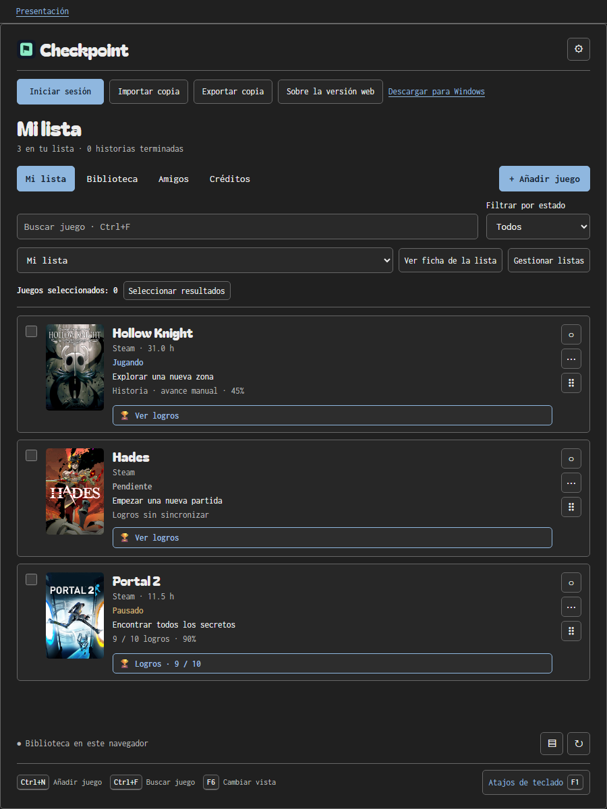
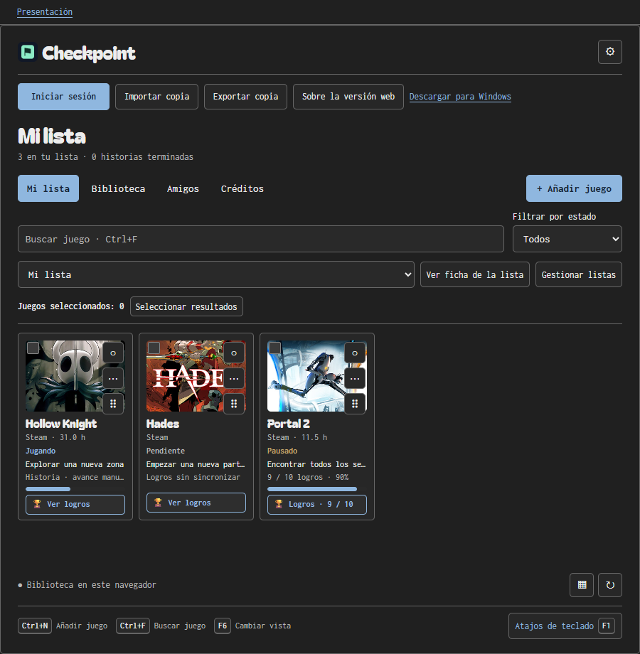
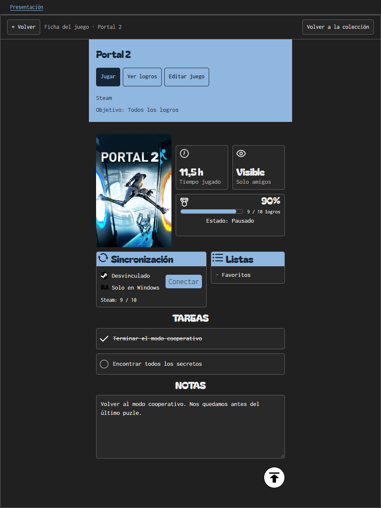
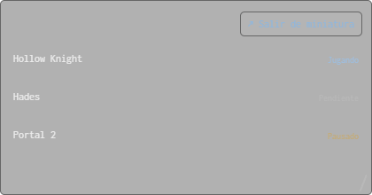
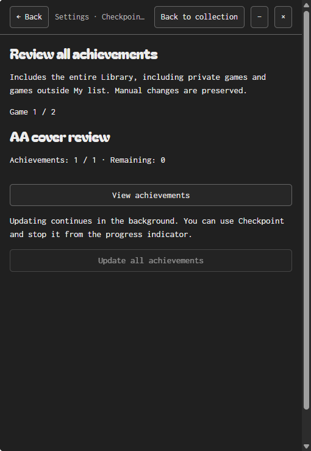
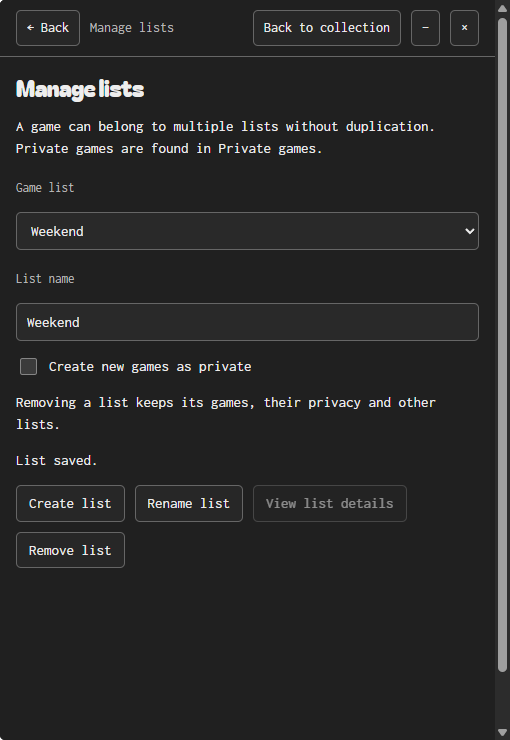
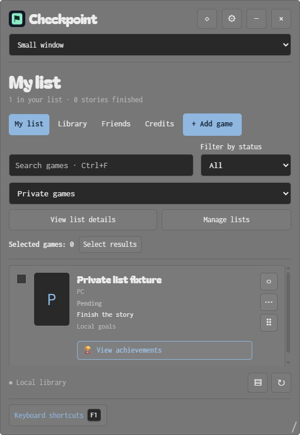
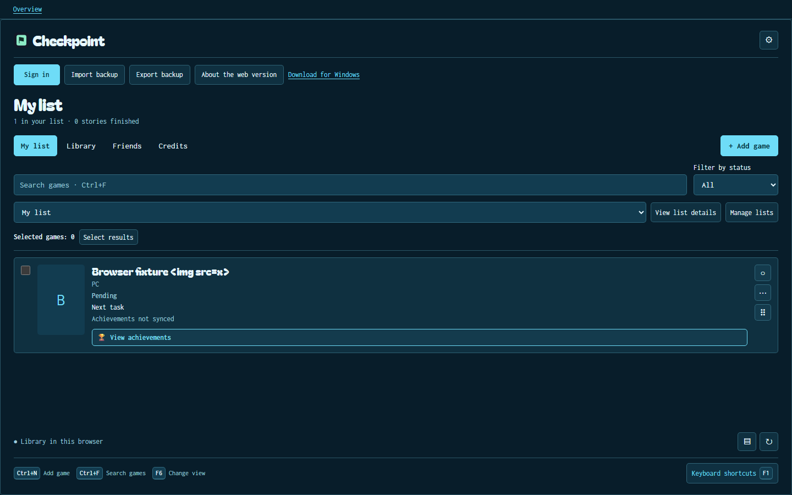
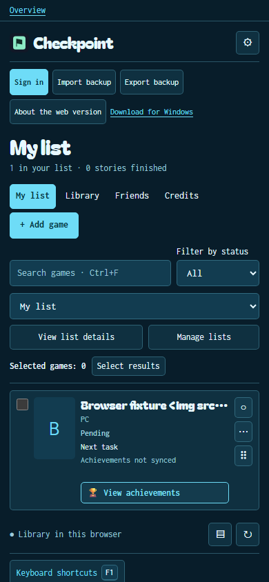

[English](en/SCREENSHOTS.md) · **Español**

# Capturas de Checkpoint

Estas imágenes muestran la interfaz actual: tipografías Bagel Fat One e Inconsolata y los mismos temas de la ficha de juego. Todas se obtienen de la aplicación real con perfiles aislados. Los juegos, tareas, tiempos y progresos son ejemplos, sin cuentas personales conectadas.

## Colección de ejemplo

La galería del README y la portada se captura por separado de las pruebas funcionales. Usa tres juegos, tema Oscuro y carátulas locales de Steam, cuyos derechos pertenecen a Team Cherry, Supergiant Games y Valve. Hay versiones completas en español e inglés.

| Lista                                                  | Cuadrícula                                               |
| ------------------------------------------------------ | -------------------------------------------------------- |
|  |  |

La **Miniatura** se captura en Windows con WebView2 real. No es una simulación de la app de navegador.

## Windows

Las capturas siguientes proceden de pruebas del paquete mediante `CapturePreviewAsync`. Las respuestas de servicios y algunos recursos son fixtures de prueba; no prueban el acceso a cuentas reales.

| Colección                                                      | Ajustes                                               |
| -------------------------------------------------------------- | ----------------------------------------------------- |
|  |  |

| Editor                                              | Atajos                                                 |
| --------------------------------------------------- | ------------------------------------------------------ |
|  |  |

| Logros                                                    | Revisión de logros                                               |
| --------------------------------------------------------- | ---------------------------------------------------------------- |
|  |  |

| Listas                                            | Juegos privados                                          |
| ------------------------------------------------- | -------------------------------------------------------- |
|  |  |

Más vistas: [ficha de juego](screenshots/css-game-details-en.png), [ficha de lista](screenshots/css-list-details-en.png), [menú de juego](screenshots/css-game-menu-en.png), [revisión de carátulas](screenshots/css-cover-review-en.png), [propuesta de IGDB](screenshots/css-igdb-cover-en.png), [amigos](screenshots/css-friends-login-en.png), [actualizador](screenshots/css-updates-en.png), [ventana completa](screenshots/css-full-window-en.png), [compacta clara](screenshots/css-compact-light-en.png), [configurar atajos](screenshots/css-configure-shortcuts-en.png) y [aviso](screenshots/css-notice-en.png).

## Los 22 temas

[Galería completa de paletas y selector](THEMES.md). Cada imagen corresponde al tema aplicado en la app real.

## Navegador y móvil

Chromium real con Playwright. Los servicios de Steam y amigos usan respuestas simuladas, y las bibliotecas están aisladas de los datos personales.

| Escritorio                                                 | Móvil                                                        |
| ---------------------------------------------------------- | ------------------------------------------------------------ |
|  |  |

Más vistas: [biblioteca](screenshots/web-library-en.png), [ficha](screenshots/web-game-details-en.png), [logros](screenshots/web-achievements-en.png), [listas](screenshots/web-lists-en.png), [privados](screenshots/web-private-games-en.png), [amigos](screenshots/web-friends-en.png), [atajos](screenshots/web-shortcuts-en.png), [ajustes móviles](screenshots/web-mobile-en.png), [inicio de sesión en español](screenshots/web-login-es.png) y [presentación pública](screenshots/web-presentation-es.png).

## Regeneración y archivo histórico

El [pipeline de capturas](SCREENSHOT-PIPELINE.md) describe fixtures, staging, evidencias necesarias y promoción. Las imágenes actuales contienen procedencia embebida y el manifiesto de cada ejecución registra sus SHA-256.

Las antiguas capturas WPF y dos vistas de logros sustituidas se conservan en un [archivo histórico explícito](screenshots/archive/README.md). No representan el diseño actual.
