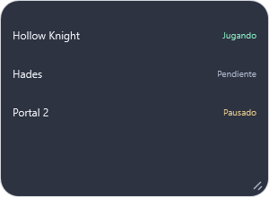
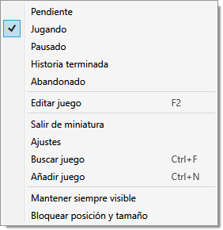

[English](en/SCREENSHOTS.md) · **Español**

# Capturas de Checkpoint 0.6.0

Estas imágenes proceden de los controles WPF reales mediante `RenderTargetBitmap`, durante la validación del ZIP de distribución. Utilizan una biblioteca aislada y respuestas HTTP simuladas. Los nombres y progresos de amigos son ficticios y la carátula privada de ejemplo es una imagen de color plano. No son una prueba de registro con cuentas reales.

## Biblioteca y carátulas

## Lista y vista compacta

| Lista oscura | Compacta clara |
| --- | --- |
|  |  |

## Cuentas y amigos de Checkpoint

| Usuario y contraseña | Progreso compartido de ejemplo |
| --- | --- |
|  |  |

## Edición y ajustes

## Regenerar

En Windows, `./scripts/Build.ps1 -Installer` ejecuta las pruebas contra el ZIP extraído y guarda las imágenes en `.qa/package-…/render`. Publica únicamente las capturas seleccionadas en `docs/screenshots`, sin subir bases de datos, sesiones o registros locales. Los límites de estas pruebas están en [VALIDATION.md](VALIDATION.md).

## Modo ligero — 0.6.3

Sin carátulas; la colección y el progreso se conservan. Captura de prueba en español.

## Miniatura — 0.6.4

Solo nombre y estado. Se activa en Ajustes o con F6; clic derecho para salir.

## Menú de juego en Miniatura — 0.6.11

El menú incluye estados, edición, búsqueda, alta y ajustes de ventana; las filas siguen mostrando solo nombre y estado.

## Teclado en Miniatura — 0.6.6

El contorno indica la fila enfocada. ↑/↓ e Inicio/Fin recorren juegos; Enter/Espacio abren su menú.

## Añadir con Miniatura vacía — 0.6.11

Clic derecho en el fondo → Añadir juego, también sin ninguna fila.

