[English](en/SCREENSHOTS.md) · **Español**

# Capturas de Checkpoint

Las capturas actuales proceden de WebView2 real. Juegos y progresos son ejemplos; no representan un registro con cuentas reales.

## 0.8.4 — propuestas de carátulas de IGDB

Vista previa con aprobación explícita y rechazo persistente. Imagen de color de prueba; [guía](IGDB.md).

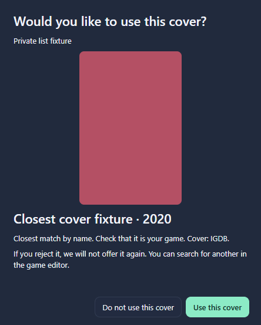

## 0.8.3 — salir de miniatura con un clic

El botón **Salir de miniatura** aparece encima de la lista y recupera la vista normal anterior sin usar el teclado ni abrir un menú.

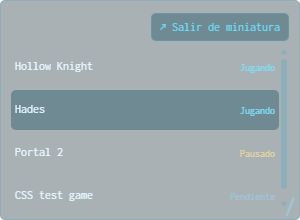

## 0.8.2 — logros destacados y descripciones

Acceso directo desde cada juego, resumen con progreso y botón para mostrar u ocultar la descripción. Datos de prueba; [guía](ACHIEVEMENTS.md).

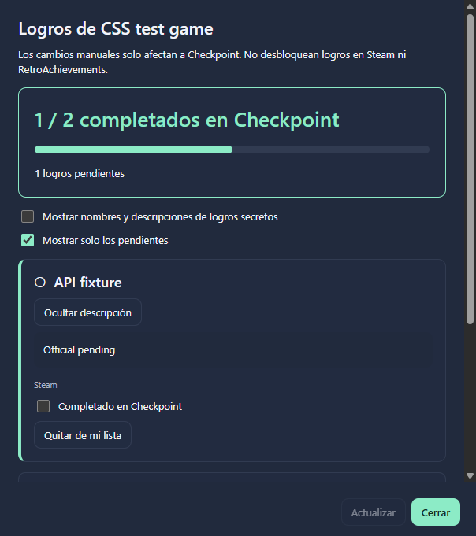

## 0.8.1 — actualizador

[Funcionamiento y edición portable](UPDATES.md). [Captura de la ventana en inglés](en/SCREENSHOTS.md#081--updater), con pruebas aisladas.

## 0.8.0 — detección y logros

[Guía](ACHIEVEMENTS.md)

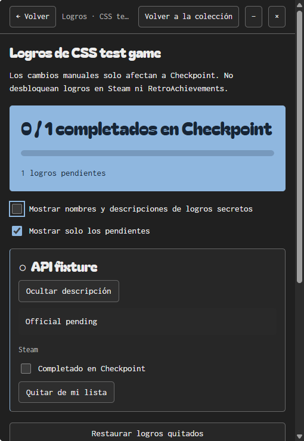

## Navegador adaptable

La web ocupa el espacio disponible sin modos de tamaño de escritorio. [Capturas de navegador ancho y estrecho con interfaz inglesa](en/SCREENSHOTS.md#responsive-browser-layout), con datos de prueba.

## 0.7.6 — listas y privacidad

Las capturas de Windows y navegador muestran Gestionar listas y la vista Privados con datos de prueba. Están en inglés en la [galería correspondiente](en/SCREENSHOTS.md#076--lists-and-privacy).

## 0.7.4 — ocho temas

En Ajustes → Tema se elige Oscuro, Claro, Medianoche, Océano, Bosque, Ciruela, Ámbar o Alto contraste. La selección muestra los colores al instante y Cancelar recupera el anterior. Las ocho paletas y el selector se muestran en la [galería con interfaz inglesa](en/SCREENSHOTS.md#074--eight-themes). Las capturas siguientes mantienen la interfaz en español.

## 0.7.3 — atajos visibles

La franja inferior muestra las teclas más útiles; F1 abre la guía completa. En Miniatura se accede desde F1 o el menú con clic derecho.

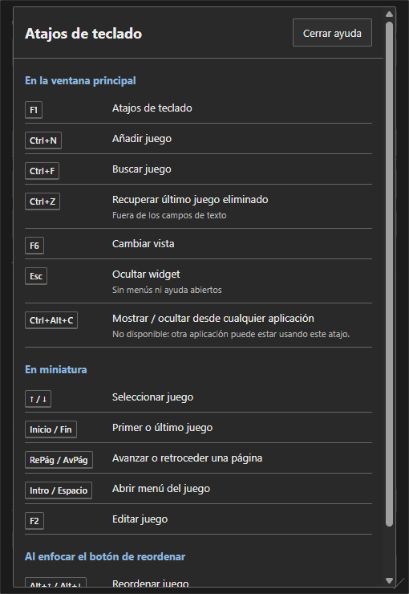

## 0.7.1 — ventana completa

La captura inglesa muestra la ventana completa con opacidad al 100 %: [ver captura](screenshots/css-full-window-en.png). El selector también está traducido a español en las capturas siguientes.

## 0.7.0 — interfaz CSS actual

Capturas de HTML/CSS real en WebView2 mediante `CapturePreviewAsync`, con datos aislados. La carátula verde es una imagen local de prueba. Las imágenes WPF siguientes se conservan como archivo histórico.

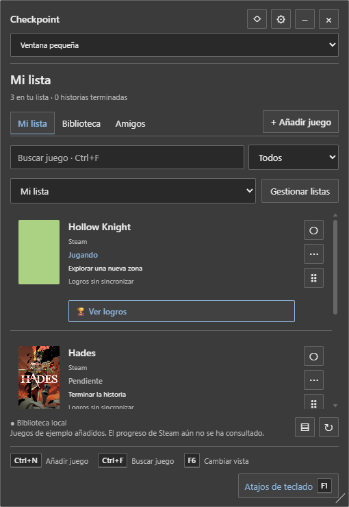

| Editor | Miniatura |
| --- | --- |
| 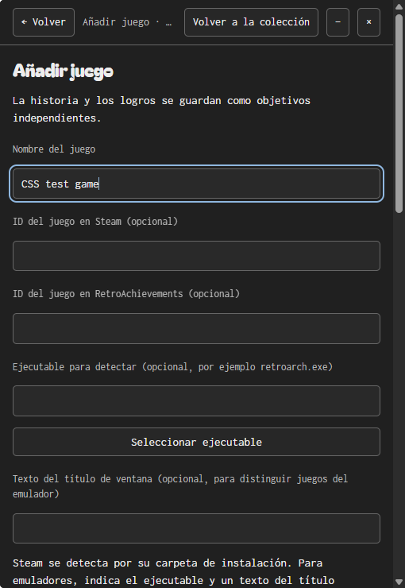 |  |

Las capturas inglesas están en la [galería en inglés](en/SCREENSHOTS.md).

## Interfaz WPF histórica (0.6.x)

## Biblioteca y carátulas

## Lista y vista compacta

| Lista oscura | Compacta clara |
| --- | --- |
|  |  |

## Cuentas y amigos de Checkpoint

| Usuario y contraseña | Progreso compartido de ejemplo |
| --- | --- |
|  |  |

## Edición y ajustes

## Regenerar

En Windows, `./scripts/Build.ps1 -Installer` ejecuta las pruebas contra el ZIP extraído y guarda las imágenes en `.qa/package-…/render`. Publica únicamente las capturas seleccionadas en `docs/screenshots`, sin subir bases de datos, sesiones o registros locales. Los límites de estas pruebas están en [VALIDATION.md](VALIDATION.md).

## Modo ligero — 0.6.3

Sin carátulas; la colección y el progreso se conservan. Captura de prueba en español.

## Miniatura — 0.6.4

Solo nombre y estado. Se activa en Ajustes o con F6; clic derecho para salir.

## Menú de juego en Miniatura — 0.6.11

El menú incluye estados, edición, búsqueda, alta y ajustes de ventana; las filas siguen mostrando solo nombre y estado.

## Teclado en Miniatura — 0.6.6

El contorno indica la fila enfocada. ↑/↓ e Inicio/Fin recorren juegos; Enter/Espacio abren su menú.

## Añadir con Miniatura vacía — 0.6.11

Clic derecho en el fondo → Añadir juego, también sin ninguna fila.

## Navegación por páginas — 0.6.12

Re Pág/Av Pág adaptan el salto a la altura de Miniatura. Datos de prueba de una colección grande.

## Texto ampliado — 0.6.13

Miniatura con tamaño de texto 18 y filas adaptadas.

## Avisos en español

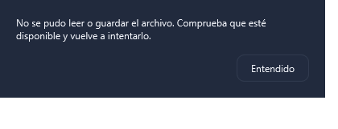

## Código de amigo completo

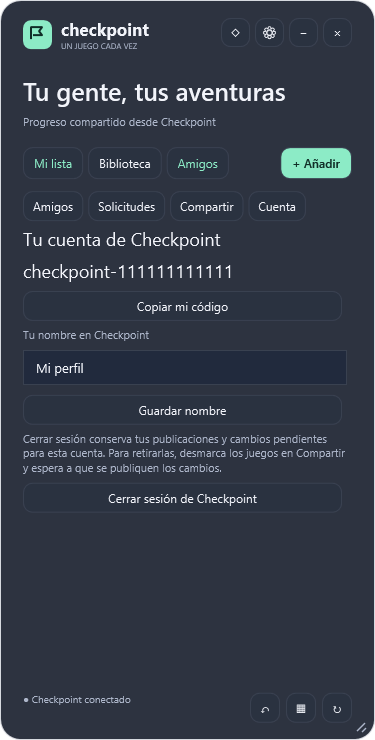

## Aplicación web

Capturas del navegador con cuentas y servicios de prueba ficticios.

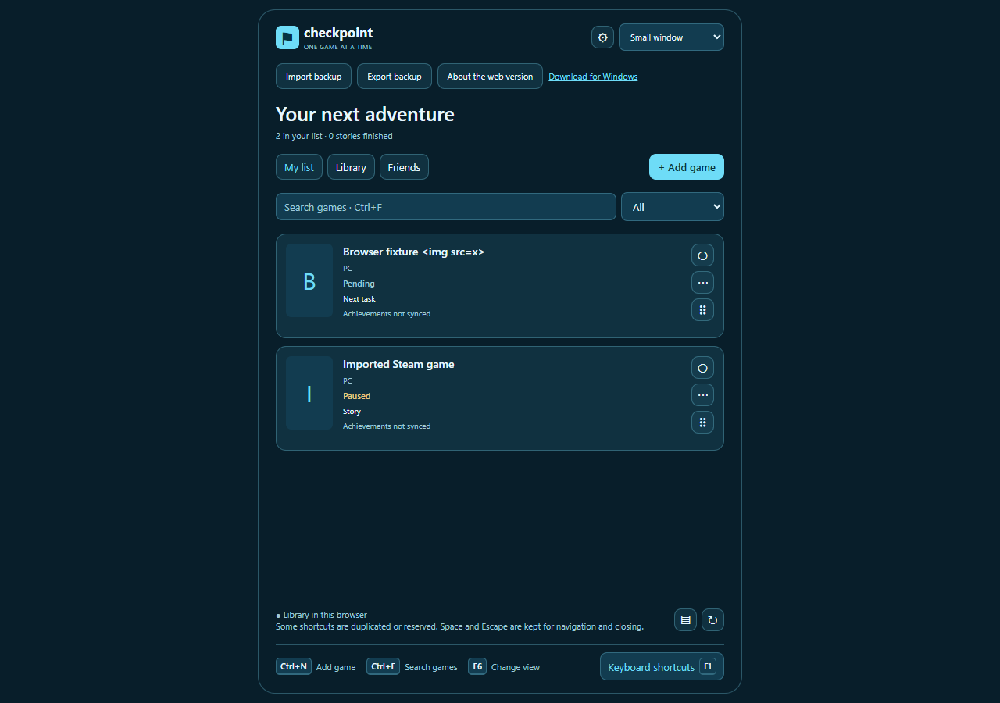

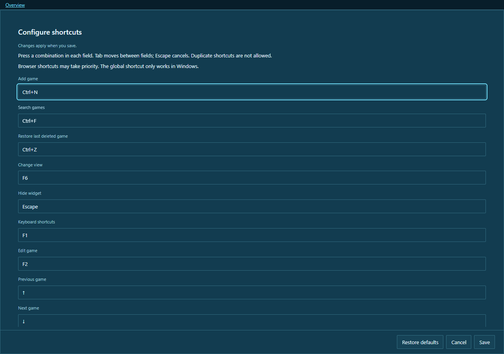

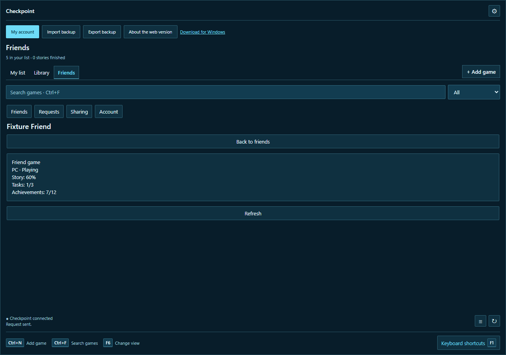

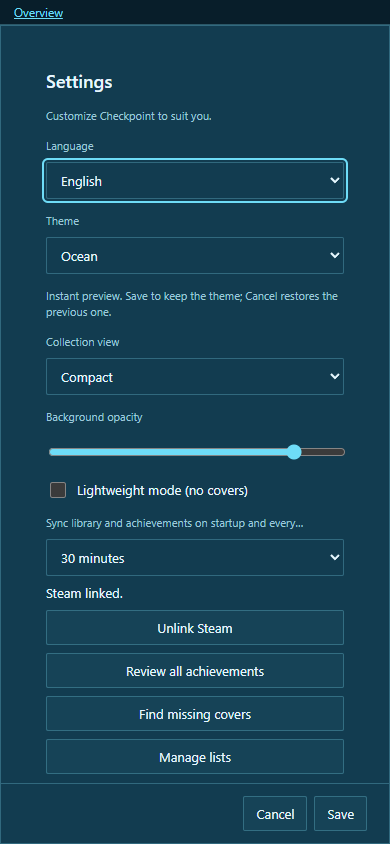
