# Temas

**Español** · [English](en/THEMES.md)

Ajustes → Tema incluye 22 paletas: las ocho originales y los catorce temas nuevos. La vista previa se aplica a la colección, diálogos, logros, amigos, avisos y Miniatura; Guardar la conserva y Cancelar recupera el tema anterior.

| Tema | Fondo | Principal | Secundario | Texto |
| --- | --- | --- | --- | --- |
| Púrpura cibernético | `#090714` | `#7C3AED` | `#06D9F7` | `#F5F3FF` |
| Azul eléctrico | `#05050C` | `#2563EB` | `#22D3EE` | `#F8FAFC` |
| Lima neón | `#060E04` | `#59E000` | `#A3FF12` | `#F5F7F5` |
| Negro y rojo | `#080808` | `#EF233C` | `#FF5A5F` | `#F7F7F7` |
| Negro y naranja | `#06060B` | `#F97316` | `#FBBF24` | `#FAFAFA` |
| Onda sintética | `#0B0617` | `#E832FF` | `#00E5FF` | `#F7F2FF` |
| Azul y blanco | `#F8FAFC` | `#2563EB` | `#FFFFFF` | `#111827` |
| Púrpura oscuro | `#111827` | `#7C3AED` | `#F9FAFB` | `#F9FAFB` |
| Esmeralda y neutro | `#F8FAFC` | `#10B981` | `#FFFFFF` | `#1F2937` |
| Negro y blanco | `#09090B` | `#FFFFFF` | `#06D9F7` | `#FFFFFF` |
| Marino y cian | `#0F172A` | `#06B6D4` | `#F8FAFC` | `#F8FAFC` |
| Coral y crema | `#FFF7ED` | `#F43F5E` | `#FFFFFF` | `#292524` |
| Naranja y carbón | `#18181B` | `#F97316` | `#FAFAFA` | `#FAFAFA` |
| Índigo y gris suave | `#F3F4F6` | `#4F46E5` | `#FFFFFF` | `#111827` |

La segunda tabla mezclada se interpreta como conjuntos de colores principales: Azul y blanco, Esmeralda y neutro, Coral y crema e Índigo y gris suave usan fondos claros. Negro y blanco utiliza cian como acento, ya que no estaba especificado. Los colores de paneles, campos, bordes y texto secundario se derivan de cada paleta; los secundarios blancos se tratan como tonos neutros, sin poner letras blancas sobre fondos claros. Los nombres siguen el idioma seleccionado. Los temas e identificadores anteriores siguen siendo válidos.

## Vistas previas de la interfaz real

Datos aislados de prueba; estas capturas proceden de la interfaz CSS del paquete de Windows.

| | |
| --- | --- |
| **Púrpura cibernético** 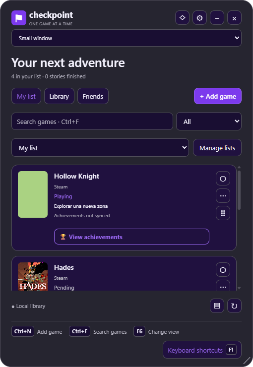 | **Azul eléctrico** 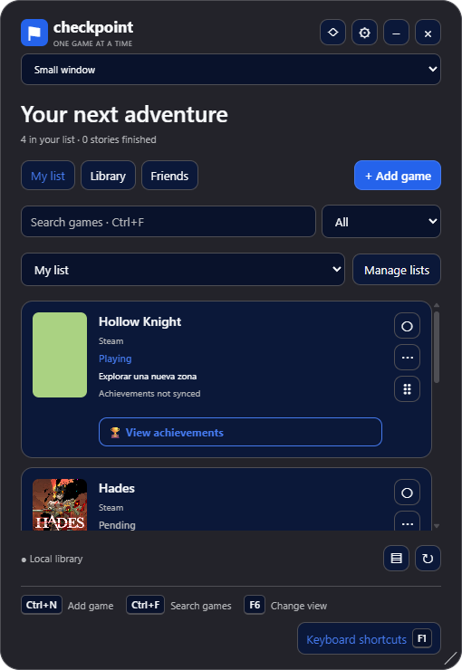 |
| **Lima neón** 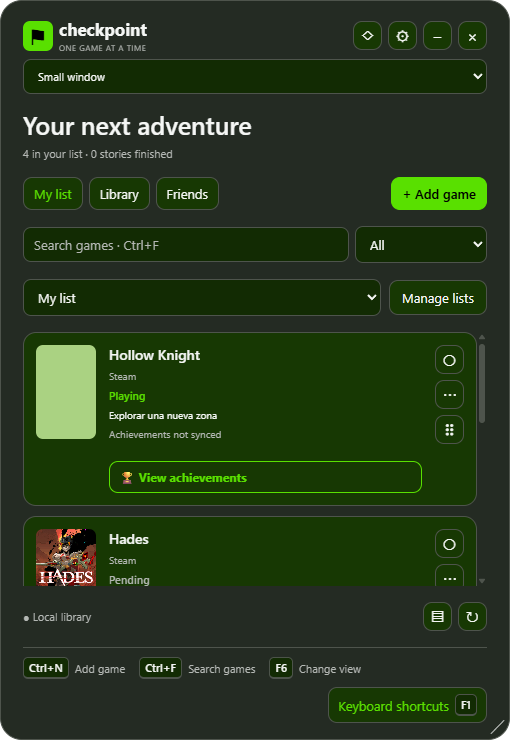 | **Negro y rojo** 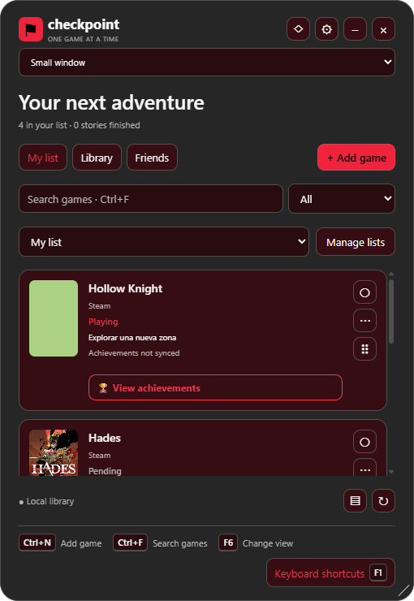 |
| **Negro y naranja** 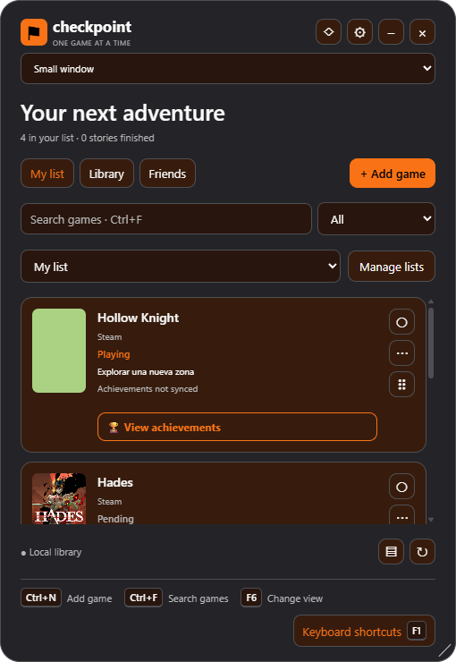 | **Onda sintética** 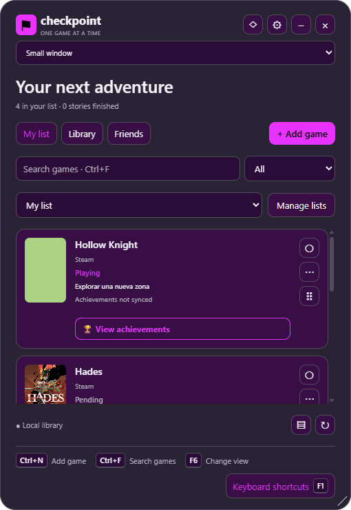 |
| **Azul y blanco** 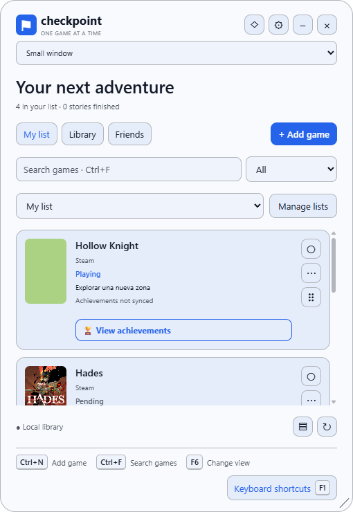 | **Púrpura oscuro** 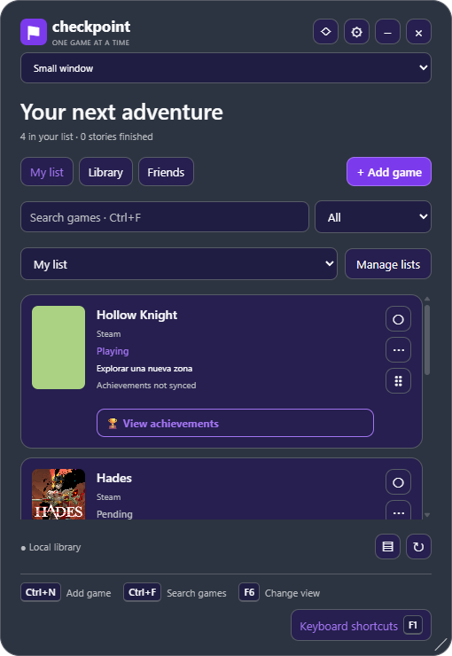 |
| **Esmeralda y neutro** 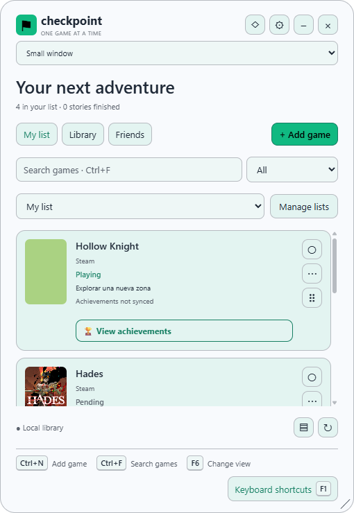 | **Negro y blanco** 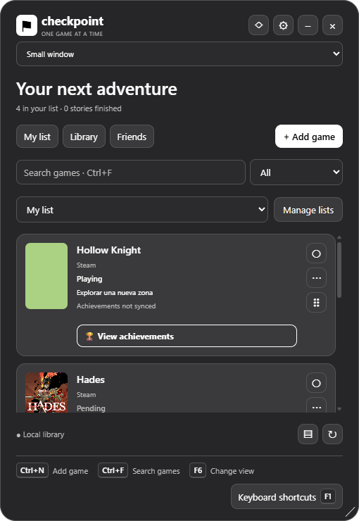 |
| **Marino y cian** 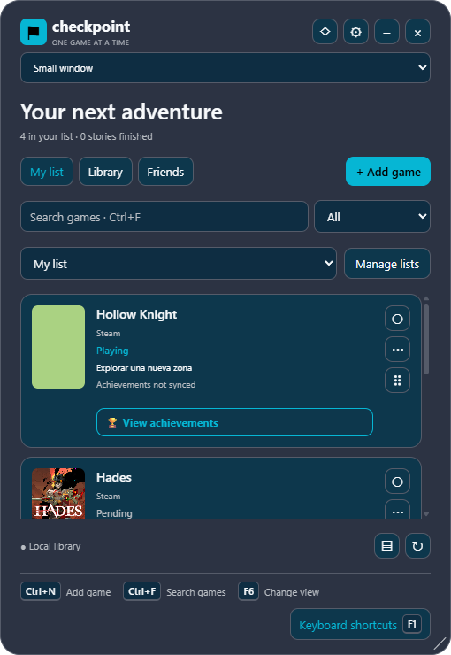 | **Coral y crema** 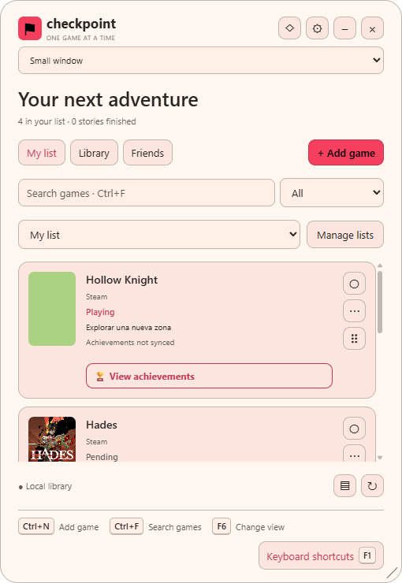 |
| **Naranja y carbón** 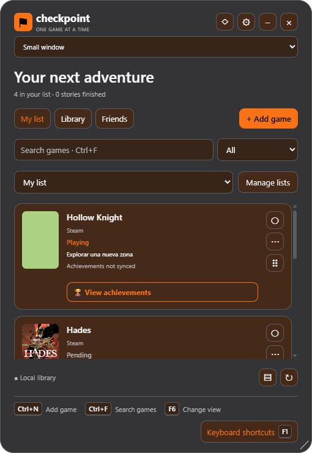 | **Índigo y gris suave** 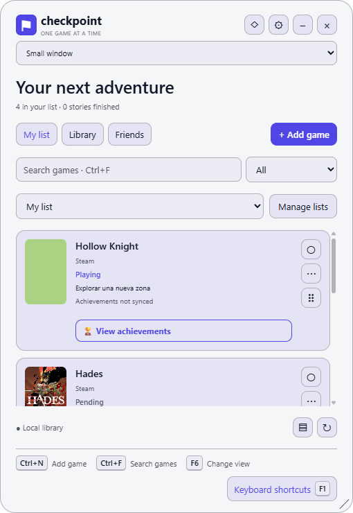 |
