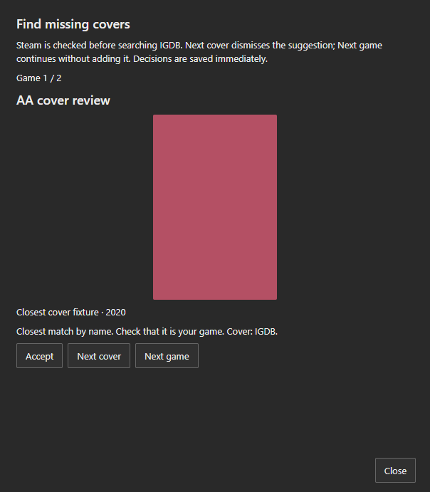

# Review the Library from Settings

## Review all achievements

Open **Settings → Review all achievements** to browse the entire Library with **Previous** and **Next game**, including private games and games outside My list. **View achievements** opens the game’s achievements, descriptions and usual filters; closing the sheet returns to the review.

**Update all achievements** fetches every linked game sequentially, without the periodic synchronization’s 20-game limit. Windows updates Steam and RetroAchievements when the accounts are linked and the game has the appropriate provider ID. The web updates Steam and displays RetroAchievements imported from a Windows backup, together with manual goals.

Manually added or removed achievements, Checkpoint completion overrides, notes, lists and privacy are preserved. Failed requests keep the last known progress and count as errors. Closing the review stops further requests; already saved updates remain. Hidden achievement names and descriptions retain the sheet’s spoiler filters.

## Find missing covers

Open **Settings → Find missing covers** to browse the Library alphabetically. The wizard checks local images and Steam first, skipping games with an available cover. For the remaining games, it searches IGDB and displays the matched name and image before asking for a decision.

- **Accept:** immediately saves the cover and advances to the next game with a missing cover.
- **Next cover:** dismisses the current image, saves the rejection and searches for another cover for the same game.
- **Next game:** continues without adding the image and remembers its rejection when a candidate was shown.
- **Close:** ends the review and retains decisions already saved.

The wizard also works in lightweight mode because the search was explicitly requested. Collection images remain hidden while that mode is enabled. If IGDB fails or has no further result, you can advance to the next game; no image is accepted automatically. Rejections are respected by future reviews and automatic suggestions. The existing limit of 200 rejected covers per game still applies.

