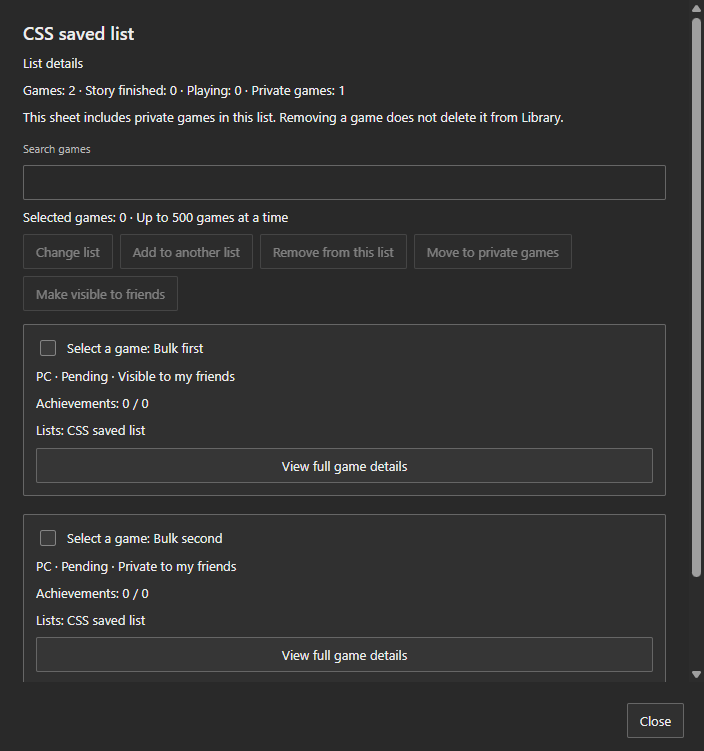

# Lists and privacy

**English** · [Español](../LISTS.md)

Since 0.7.6, signing in automatically makes **My list** visible to accepted Checkpoint friends. Games are not public on the Internet. Steam imports in **Library** are not shared until tracked. Notes, task labels and individual achievement details stay private; custom goal text is shared.

- **Private from the start:** enable **Private to my friends** in the editor before Save. Adding from Private games already enables it.
- **Change afterwards:** game menu → **Move to private games** or **Make visible to friends**; the editor and Friends → Sharing also change visibility.
- **View private games:** select **Private games** beside Search. They stay out of My list and custom list views, and remain in Library.
- **Default private additions:** Manage lists → Create new games as private → Save. Existing games are unchanged.
- **Multiple lists:** Manage lists → enter a name → Create list. Select memberships in the game editor. A game may belong to several without duplicate records. Up to 30 lists, 1–40 characters and unique names ignoring case.
- **Rename or remove:** select the list in Manage lists. Removing preserves games, privacy and other memberships. Empty lists persist too. Rename and removal also update games in deletion recovery.

Names and memberships are local organization. Friends see all visible game progress without list grouping. In the Windows edition, Miniature keeps the selected list and only shows names and states; its menu changes the selected list.

Explicit withdrawals from older versions are preserved as private. Other tracked games use the new default visibility. Privacy changes persist offline, but previously published progress may remain visible until the server confirms withdrawal. Signing out does not withdraw publications.

Windows JSON and .checkpoint backups retain privacy, memberships and empty lists; the web supports JSON. Sessions and the social queue are excluded. Import skips existing games to preserve current data. The default for future games is a local setting and is not exported.

## Creating lists and managing games

Enter a name in Manage lists and press Save to create and open the list. Create list remains available for creating several without closing the manager. When you select an existing list and edit its name, Save applies that change.

A game context menu contains game actions. It offers the three most recently created lists, Change list for any destination, and Add to another list to keep existing memberships. Window and app commands remain in their controls or the Miniature background menu.

In Library and normal lists, tick game checkboxes. The selection bar handles up to 500 games. Select results selects up to 500 matches for the current filter; changing view, list or filter clears the selection.

Moving from a custom list removes only that source membership and adds the destination, keeping other lists. Moving from Library or My list replaces current memberships. Adding keeps other lists. Moving from the private view retains other memberships and privacy. These actions preserve privacy, notes, tasks and achievements. Removing custom membership keeps the game in Library; Remove from My list stops tracking it and withdraws sharing when connected. Make visible to friends also tracks an untracked Library game.

View list details opens counts, search and individually selectable members, in pages of 50. It includes private members for owner management even when they are hidden in that list's public view. Open a full game sheet, move selected games, remove memberships or change privacy. Privacy applies to the game across all its lists; changing it does not change memberships.

