# Checkpoint screenshots

**English** · [Español](../SCREENSHOTS.md)

Current captures use actual WebView2 HTML/CSS through `CapturePreviewAsync` in isolated package tests. Older WPF captures below are archived examples. Games/users/progress are fixtures, HTTP replies are simulated, and private cover artwork uses a solid-color image. This is not real-account signup evidence.

## 0.7.4 — eight themes

Live palettes from the actual packaged application. Settings → Theme previews immediately; Save keeps the choice and Cancel restores the previous one.

| Dark | Light |
| --- | --- |
| 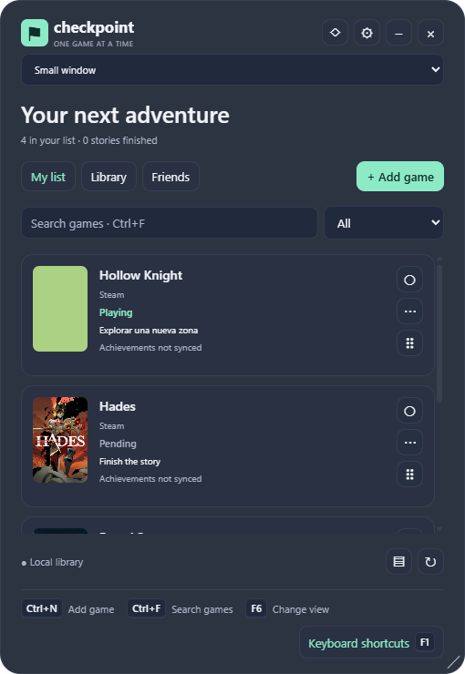 | 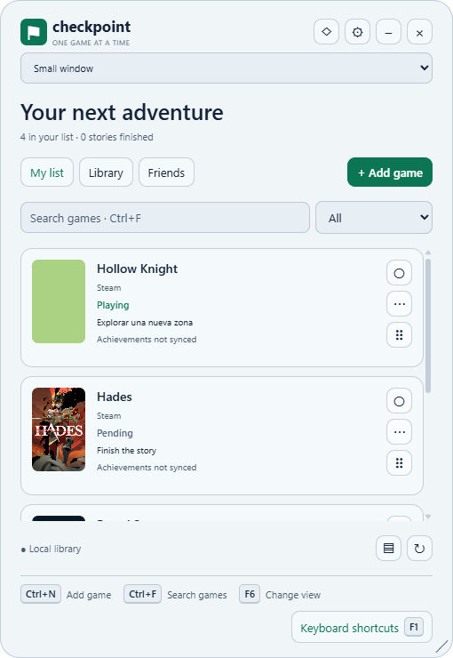 |

| Midnight | Ocean |
| --- | --- |
| 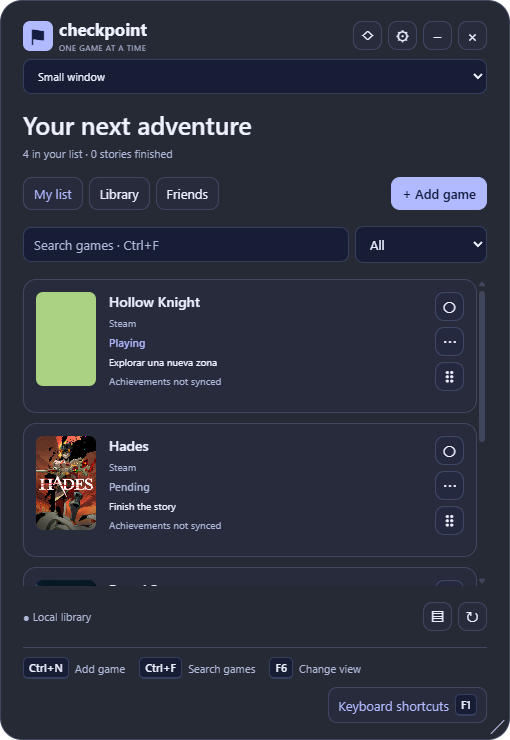 | 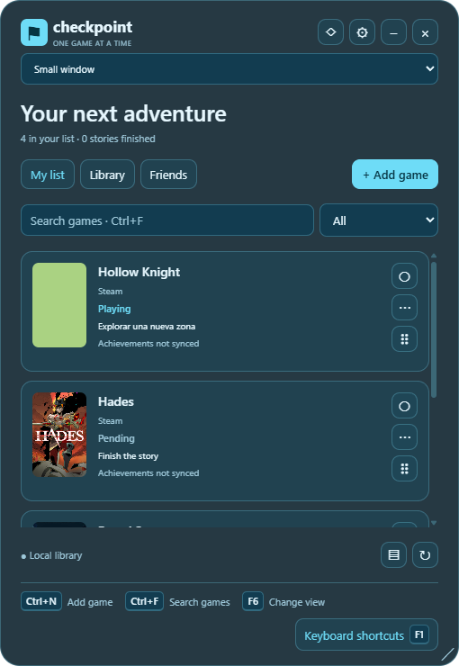 |

| Forest | Plum |
| --- | --- |
| 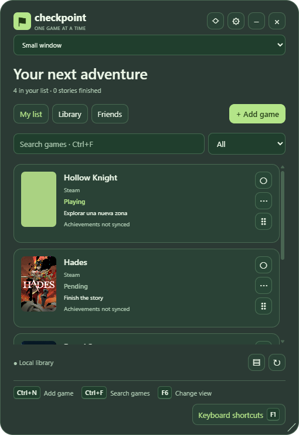 | 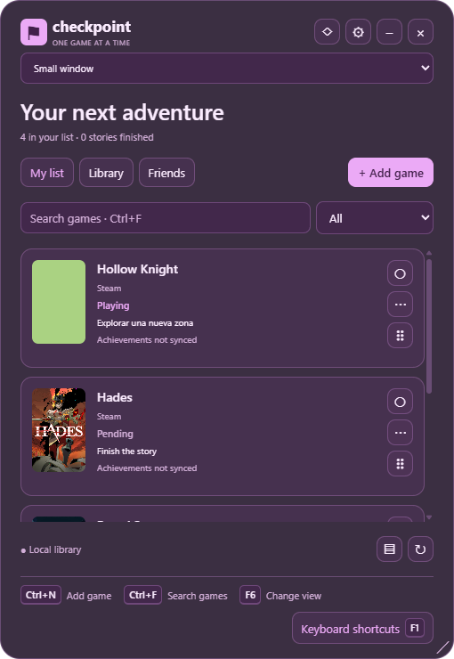 |

| Amber | High contrast |
| --- | --- |
| 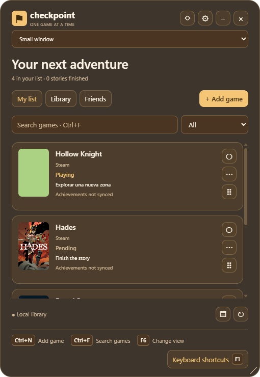 | 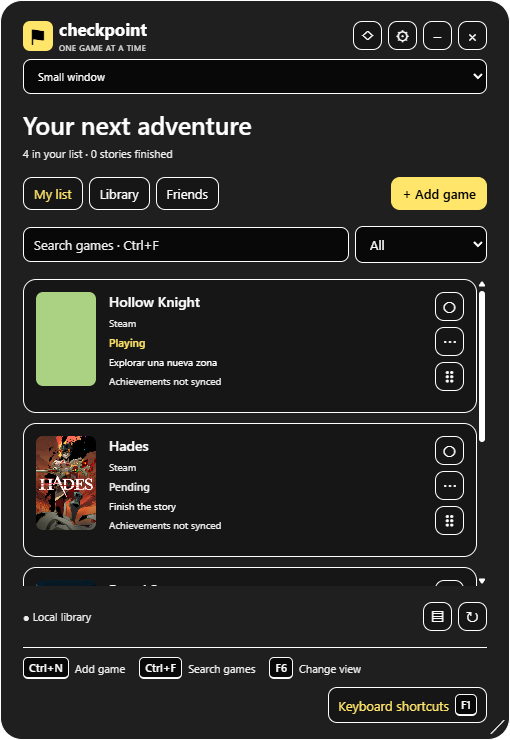 |

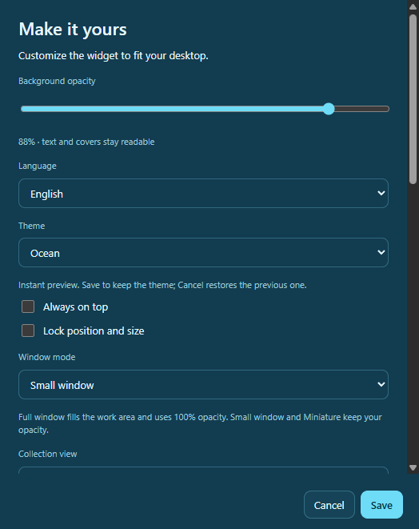

## 0.7.3 — visible keyboard shortcuts

The bottom strip shows useful key gestures; F1 opens the complete guide. Miniature offers F1 and a context-menu entry.

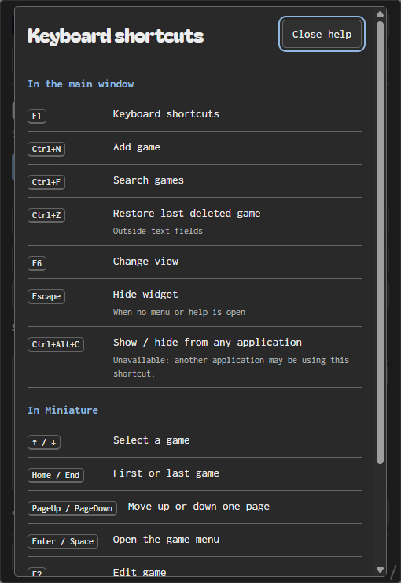

## 0.7.1 — full window

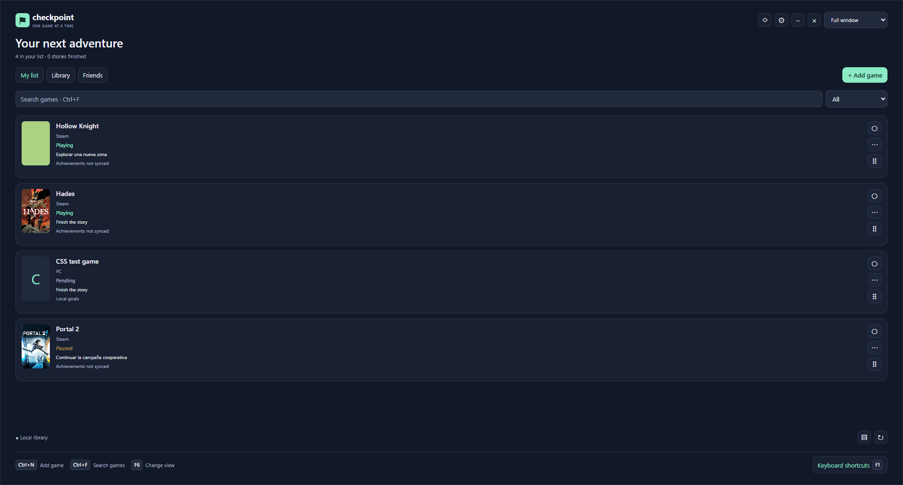

## 0.7.0 — current CSS interface

| Friends login | Miniature |
| --- | --- |
| 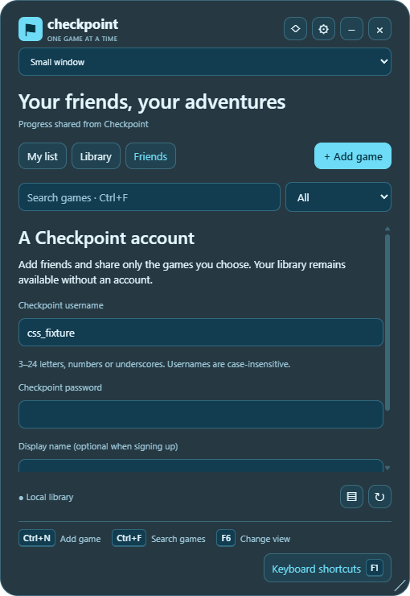 | 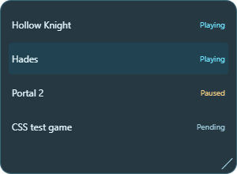 |

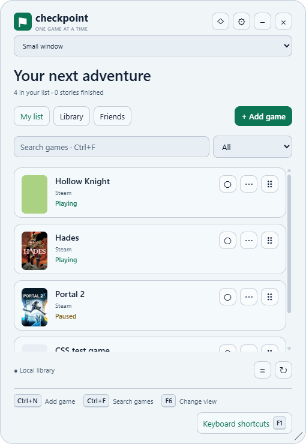

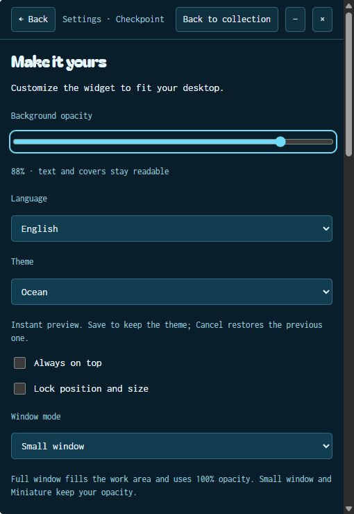

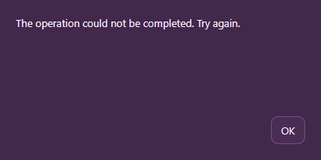

Spanish captures: [widget](../screenshots/css-widget-es.png), [editor](../screenshots/css-editor-es.png), [Miniature](../screenshots/css-miniature-es.png).

## Archived WPF interface (0.6.x)

## English

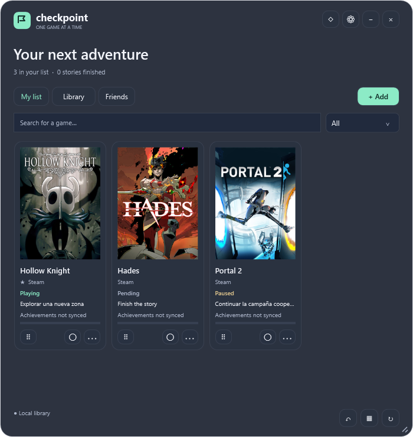

| Account | Friend progress |
| --- | --- |
| 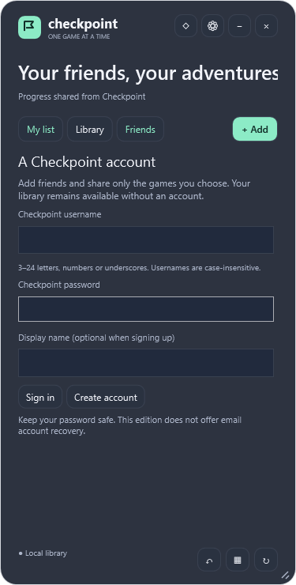 | 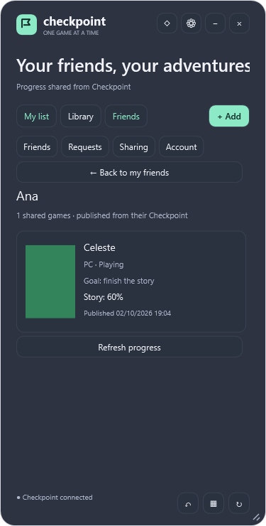 |

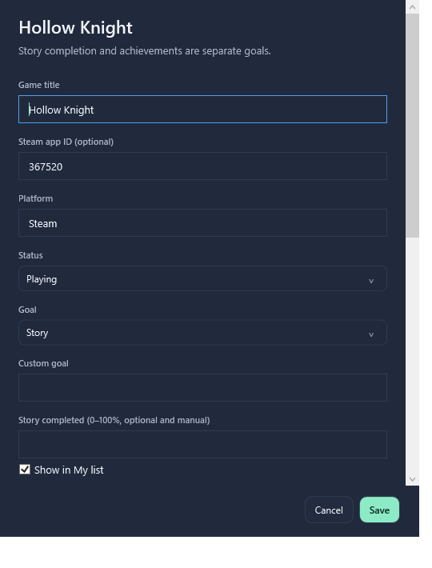

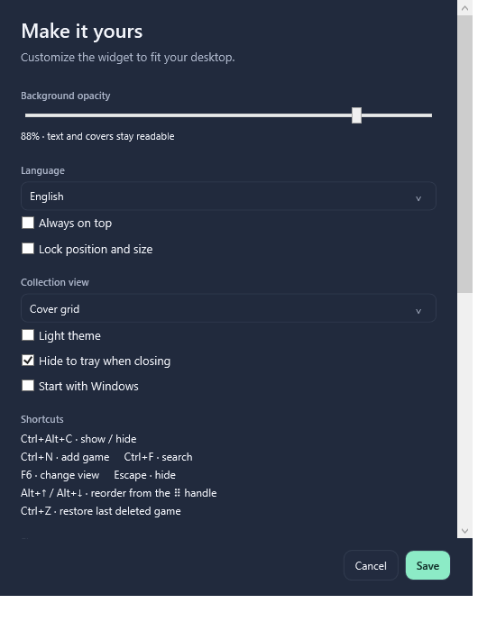

## Spanish

| List | Compact |
| --- | --- |
|  | 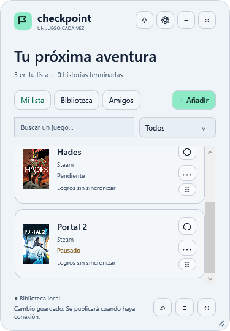 |

| Account | Friends |
| --- | --- |
| 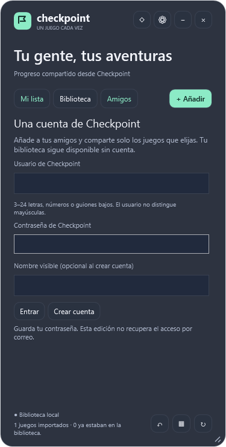 |  |

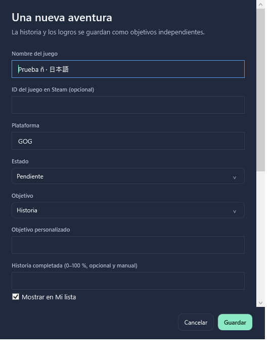

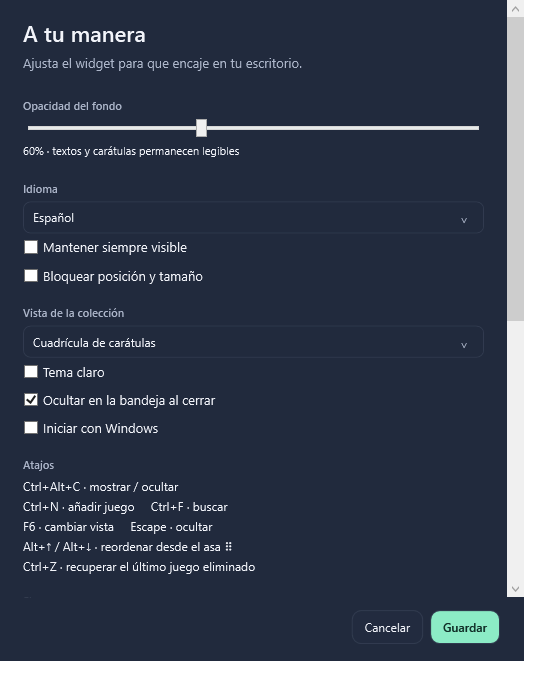

Regenerate with `./scripts/Build.ps1 -Installer` on Windows. Output: `.qa/package-…/render`. Publish selected PNGs only, excluding libraries, sessions and local logs. See [validation](VALIDATION.md).

## Lightweight mode — 0.6.3

Covers are hidden while games and progress remain. This test capture uses Spanish; the setting is also available in English.

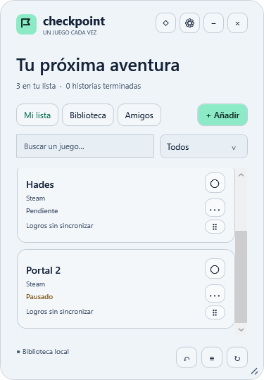

## Miniature — 0.6.4

Only name and state. Enable from Settings or F6; right-click to exit.

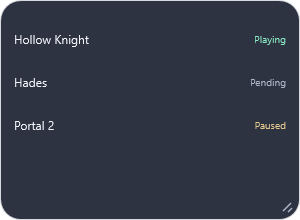

## Miniature game menu — 0.6.11

The menu includes states, editing, search, adding and window settings; rows still show only name and state.

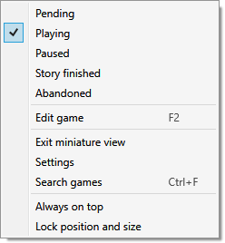

## Keyboard in Miniature — 0.6.6

The outline marks the focused row. Up/Down and Home/End select games; Enter/Space open the menu. Capture uses Spanish.

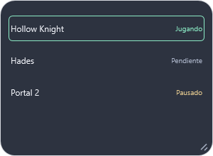

## Add from empty Miniature — 0.6.11

Right-click the background → Add game, including with no rows. This native capture uses Spanish.

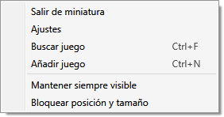

## Page navigation — 0.6.12

PageUp/PageDown adapt the jump to Miniature height. Native capture uses Spanish and a large sample collection.

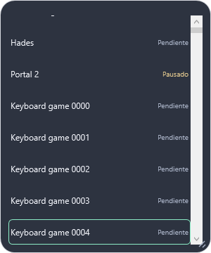

## Larger text — 0.6.13

Miniature with text size 18 and adapted rows. This native capture uses Spanish.

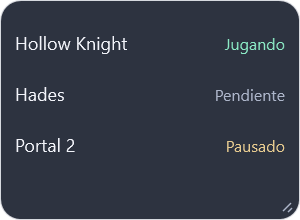

## Notices in English

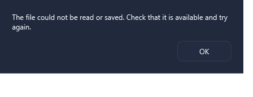

## Complete friend code

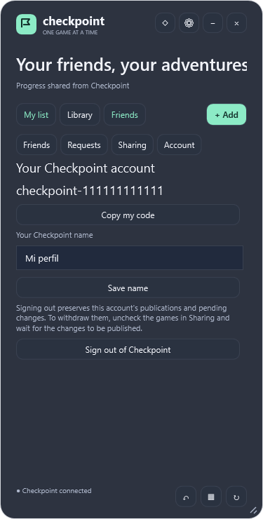
