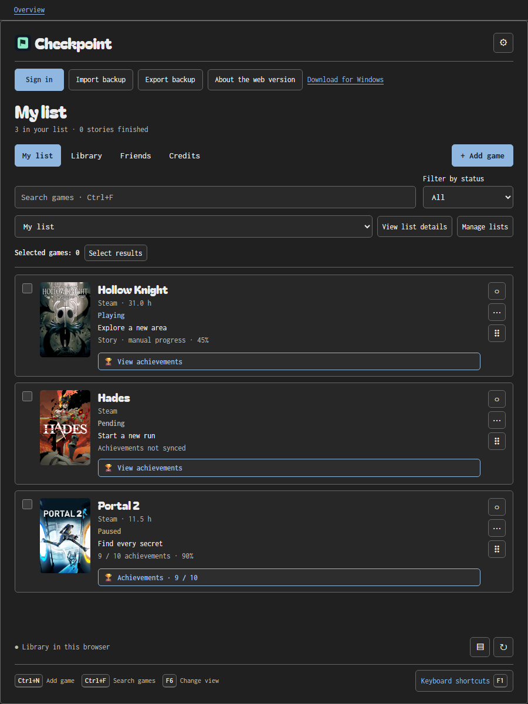
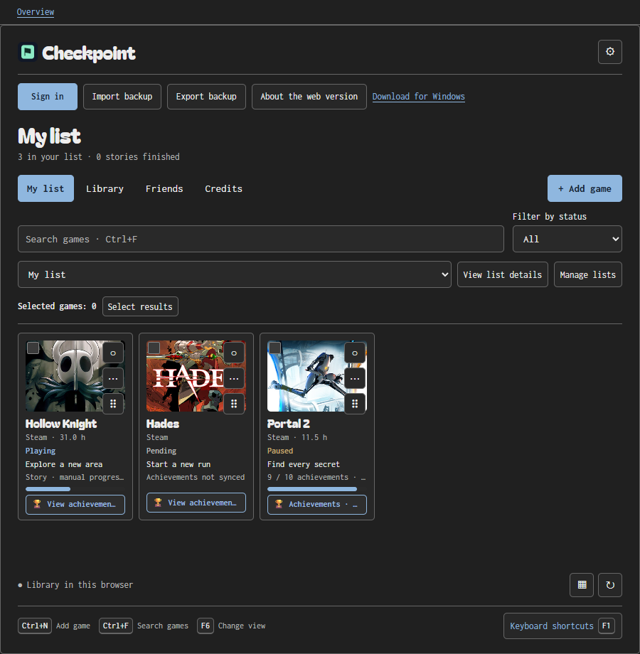
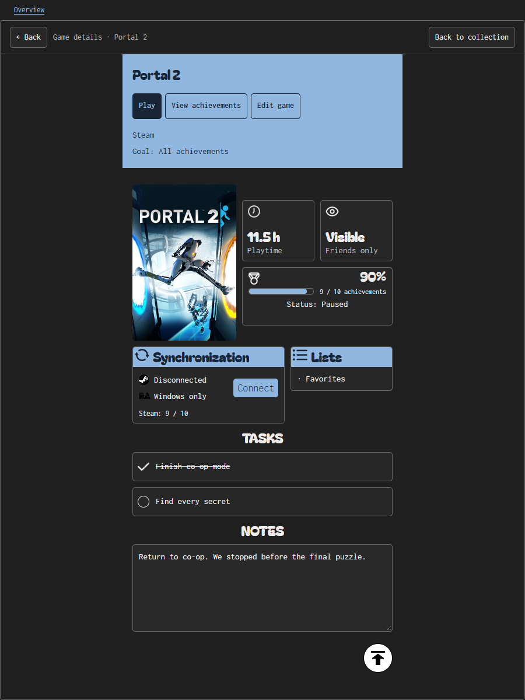
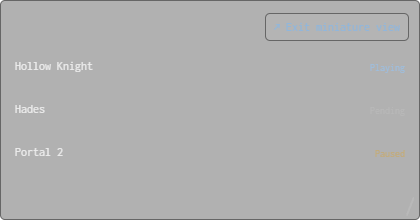
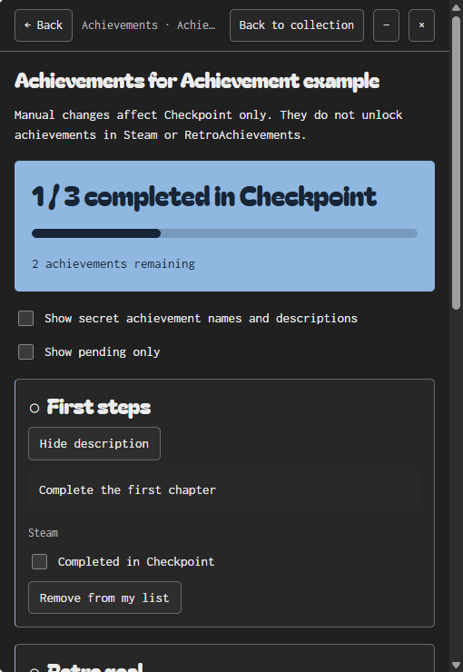

# Checkpoint screenshots

**English** · [Español](../SCREENSHOTS.md)

These images show the current interface: Bagel Fat One and Inconsolata typography and the game sheet's shared themes. Every capture uses the actual application with an isolated profile. Games, tasks, playtime and progress are examples; no personal account is connected.

## Example collection

README and presentation images are captured separately from functional tests. They use three games, the Dark theme and local Steam artwork owned by Team Cherry, Supergiant Games and Valve. Each scene has complete English and Spanish versions.

| List                                                  | Cover grid                                         |
| ----------------------------------------------------- | -------------------------------------------------- |
|  |  |

**Miniature** is captured in actual Windows WebView2. It is not a browser-app simulation.

## Windows

The following captures come from package tests through `CapturePreviewAsync`. Service replies and some artwork are test fixtures; they do not demonstrate real-account access.

| Collection                                                         | Settings                                        |
| ------------------------------------------------------------------ | ----------------------------------------------- |
|  |  |

| Editor                                              | Shortcuts                                                 |
| --------------------------------------------------- | --------------------------------------------------------- |
|  |  |

| Achievements                                                    | Achievement review                                                  |
| --------------------------------------------------------------- | ------------------------------------------------------------------- |
|  |  |

| Lists                                            | Private games                                             |
| ------------------------------------------------ | --------------------------------------------------------- |
|  |  |

More views: [game details](../screenshots/css-game-details-en.png), [list details](../screenshots/css-list-details-en.png), [game menu](../screenshots/css-game-menu-en.png), [cover review](../screenshots/css-cover-review-en.png), [IGDB proposal](../screenshots/css-igdb-cover-en.png), [friends](../screenshots/css-friends-login-en.png), [updater](../screenshots/css-updates-en.png), [full window](../screenshots/css-full-window-en.png), [Light compact view](../screenshots/css-compact-light-en.png), [shortcut configuration](../screenshots/css-configure-shortcuts-en.png) and [notice](../screenshots/css-notice-en.png).

## All 22 themes

[Full palette and selector gallery](THEMES.md). Each image shows the theme applied to the actual application.

## Browser and mobile

Actual Chromium controlled by Playwright. Steam and friends use simulated replies and all libraries are isolated from personal data.

| Desktop                                                    | Mobile                                                      |
| ---------------------------------------------------------- | ----------------------------------------------------------- |
|  |  |

More views: [library](../screenshots/web-library-en.png), [game details](../screenshots/web-game-details-en.png), [achievements](../screenshots/web-achievements-en.png), [lists](../screenshots/web-lists-en.png), [private games](../screenshots/web-private-games-en.png), [friends](../screenshots/web-friends-en.png), [shortcuts](../screenshots/web-shortcuts-en.png), [mobile settings](../screenshots/web-mobile-en.png), [English sign-in](../screenshots/web-login-en.png) and [public presentation](../screenshots/web-presentation-en.png).

## Regeneration and historical archive

The [capture pipeline](../SCREENSHOT-PIPELINE.md) documents fixtures, staging, required evidence and promotion. Current images contain embedded provenance; each run's manifest records their SHA-256 checksums.

Older WPF images and two superseded achievement views are kept in an explicit [historical archive](../screenshots/archive/README.md). They do not represent the current design.
